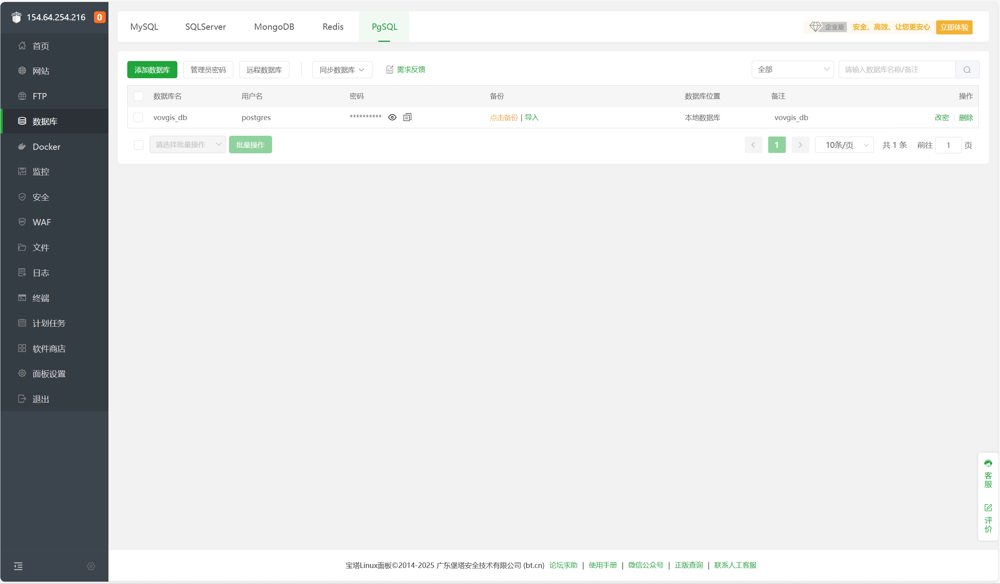
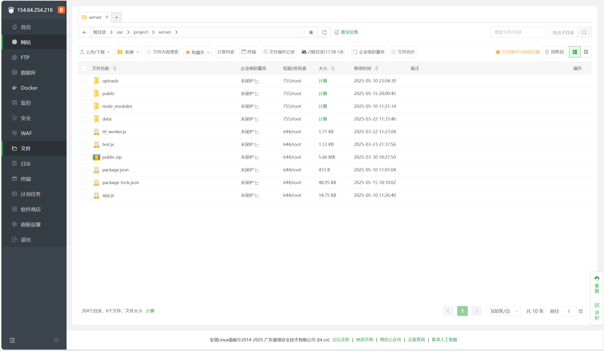

# 丽水市森林可持续生产力可视化平台系统文档

## 一、项目概述
丽水市森林可持续生产力可视化平台系统是一个基于WebGIS的综合性数据可视化平台，旨在为林业管理部门提供森林资源数据的动态监测、时空分析和管理功能。系统整合了二维地图、三维地球、数据分析和后台管理功能，支持多种森林相关数据类型的可视化展示与分析。

## 二、项目文件结构及功能说明

### 前端核心组件
1. **OpenlayersMap.vue**  
   - **功能**：实现二维GIS地图展示功能
   - **特点**：
     - 支持栅格数据动态渲染
     - 提供时间动画播放控制
     - 交互式图例系统
     - 矢量数据分层显示
   - **用法**：通过侧边栏导航进入"二维地图"功能

2. **EchartsMap.vue**  
   - **功能**：实现数据统计分析功能
   - **特点**：
     - 支持多种图表类型（折线图、直方图、热力图）
     - 时间序列分析
     - 数据分布可视化
   - **用法**：通过侧边栏导航进入"数据分析"功能

3. **DataManagement.vue**  
   - **功能**：实现数据管理后台
   - **特点**：
     - 三级数据目录管理
     - TIF文件元数据自动计算
     - 批量上传/删除功能
   - **用法**：通过侧边栏导航进入"数据管理"功能

4. **UserManagement.vue**  
   - **功能**：实现用户权限管理
   - **特点**：
     - 多级用户权限控制
     - 用户增删改查功能
   - **用法**：通过侧边栏导航进入"用户管理"功能

### 路由配置
- **router/index.js**  
  - **功能**：定义应用路由和权限控制
  - **特点**：
    - 路由守卫实现权限控制
    - 角色区分（管理员/普通用户/游客）
    - 路由懒加载优化性能

### 后端服务
- **server.js**  
  - **功能**：Express服务端主程序
  - **特点**：
    - RESTful API设计
    - 空间数据处理管线
    - 数据库连接管理
    - 文件上传处理
  - **用法**：作为Node.js服务入口启动

### 核心工具
- **GeoTIFF-processor.js**  
  - **功能**：处理空间数据格式转换
  - **特点**：
    - 栅格数据元数据计算
    - 动态配色生成
    - 数据压缩优化
  
## 三、部署方法

### 部署步骤
1. **数据库初始化**
先安装好PostgreSQL数据库，然后在PostgreSQL中创建名为"vovgis_db"的数据库，之后启动后端服务自动初始化数据库。

2. **启动后端服务**
在server文件夹下打开终端，输入以下命令启动服务：
   ```bash
   node server.js
   ```

3. **前端打包**
在client文件夹下打开终端，输入以下命令进行前端打包：
   ```bash
   npm run build
   ```

4. **前端运行**
在client文件夹下打开终端，输入以下命令进行前端运行：
   ```bash
   npm run dev
   ```

5. **服务器部署**
首先将前端打包后的文件（dist文件夹）粘贴到server/public文件夹中，然后将server文件夹上传到服务器上，最后再服务器上安装好postgresql与nodejs环境，启动服务即可。如下图：

